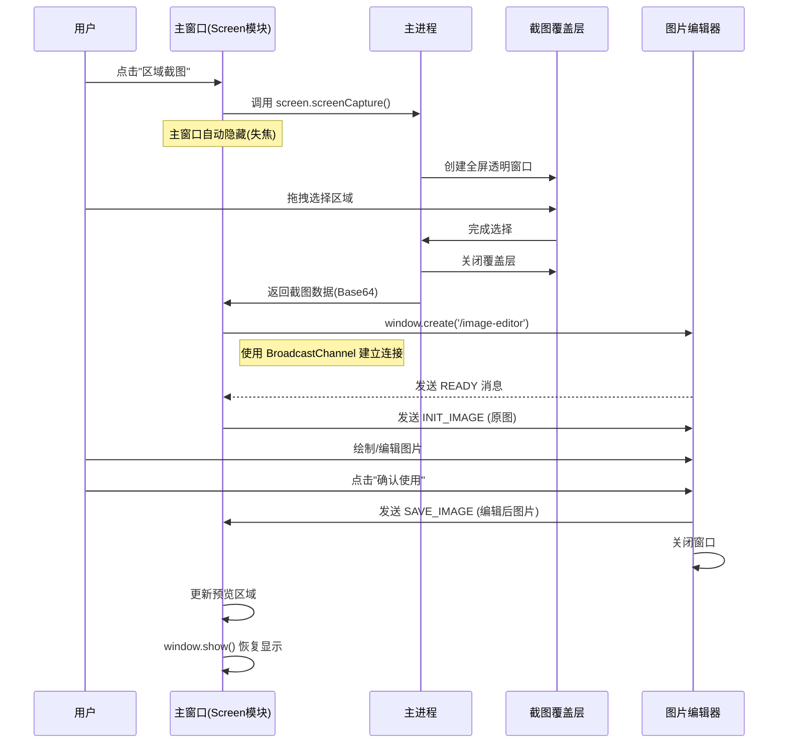

# Mulby Showcase

**综合展示 Mulby 所有 API 能力的示例插件**


## 功能特性

这个插件是 Mulby 平台的完整功能展示，涵盖了所有 20+ 个 API 模块：

| 模块 | 涵盖的 API | 功能描述 |
|------|-----------|---------|
| 📊 **系统信息** | system, power, geolocation, network | 系统/应用信息、电源状态、位置信息、网络状态 |
| 📋 **剪贴板** | clipboard, notification | 剪贴板读写、格式检测、图片和文件支持 |
| ⌨️ **输入控制** | input | 隐藏主窗口后粘贴文本/图片/文件或模拟键入 |
| 📁 **文件管理** | filesystem, dialog, shell | 文件操作、对话框、系统打开、Finder 定位 |
| 🌐 **网络与HTTP** | http, network | HTTP 请求测试、网络状态监控 |
| 🖥️ **屏幕与捕获** | screen, media, window | 显示器信息、区域截图、多窗口协作、媒体权限 |
| 🔊 **媒体与音频** | tts, shell | 语音合成、系统提示音 |
| ⚙️ **高级设置** | theme, window, shortcut, tray, menu | 主题切换、窗口控制、快捷键、托盘、菜单 |
| 🔐 **安全与存储** | security, storage | 加密存储、数据持久化 |

## 触发方式

插件支持多种触发关键词：

- `showcase` / `demo` / `示例` - 打开功能展示面板
- `sysinfo` / `系统信息` - 直接进入系统信息模块
- `cb` / `剪贴板` - 直接进入剪贴板管理
- `input` / `输入` - 直接进入输入控制
- `files` / `文件` - 直接进入文件管理
- `http` / `网络` - 直接进入网络测试
- `screenshot` / `截图` / `screen` - 直接进入截图功能
- `tts` / `语音` / `朗读` - 直接进入语音合成
- `settings` / `设置` - 直接进入高级设置

## 开发

### 安装依赖

```bash
npm install
```

### 开发模式

```bash
npm run dev
```

### 构建

```bash
npm run build
```

### 打包

```bash
npm run pack
```

## 项目结构

```
mulby-showcase/
├── manifest.json              # 插件配置
├── package.json
├── src/
│   ├── main.ts                # 后端入口
│   └── ui/
│       ├── App.tsx            # 主应用
│       ├── styles.css         # 全局样式
│       ├── components/        # 通用组件
│       │   ├── Sidebar.tsx
│       │   ├── PageHeader.tsx
│       │   ├── Card.tsx
│       │   ├── Button.tsx
│       │   ├── StatusBadge.tsx
│       │   └── CodeBlock.tsx
│       ├── hooks/             # 自定义 Hooks
│       │   ├── useTheme.ts
│       │   ├── useNotification.ts
│       │   └── useMulby.ts
│       └── modules/           # 功能模块
│           ├── SystemInfo/
│           ├── Clipboard/
│           ├── Input/
│           ├── FileManager/
│           ├── Network/
│           ├── Screen/
│           ├── Media/
│           ├── Settings/
│           └── Security/
├── dist/                      # 后端构建输出
└── ui/                        # UI 构建输出
```

## API 覆盖

此插件完整展示了 Mulby 的以下 API：

### 基础 API
- ✅ `clipboard` - 剪贴板操作
- ✅ `input` - 输入与粘贴模拟
- ✅ `notification` - 系统通知
- ✅ `storage` - 数据存储
- ✅ `window` - 窗口控制
- ✅ `http` - HTTP 请求
- ✅ `filesystem` - 文件系统

### 系统 API
- ✅ `theme` - 主题管理
- ✅ `screen` - 屏幕信息与截图
- ✅ `shell` - 系统操作
- ✅ `dialog` - 对话框
- ✅ `system` - 系统信息
- ✅ `power` - 电源状态

### 高级 API
- ✅ `shortcut` - 全局快捷键
- ✅ `security` - 加密存储
- ✅ `media` - 媒体权限
- ✅ `tray` - 系统托盘
- ✅ `network` - 网络状态
- ✅ `menu` - 右键菜单
- ✅ `geolocation` - 地理位置
- ✅ `tts` - 语音合成
- ✅ `window` - 多窗口管理 (create/show/close)

## 典型案例：区域截图与编辑流程

本项目实现了一个经典的"区域截图 -> 独立窗口编辑 -> 回传主窗口"的工作流，展示了多窗口协作与数据传递的最佳实践。



### 关键技术点

1.  **多窗口管理**：使用 `window.mulby.window.create` 创建独立的编辑器窗口，互不干扰。
2.  **窗口通信**：使用 Web 标准 `BroadcastChannel` 实现主窗口与编辑器窗口的直接通信，无需经过主进程中转，高效且低延迟。
3.  **可见性控制**：利用 `window.show()` 确保截图流程结束后主窗口能正确恢复显示。

## 许可证

MIT License
